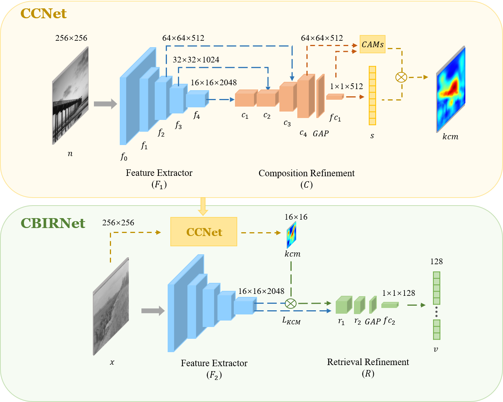
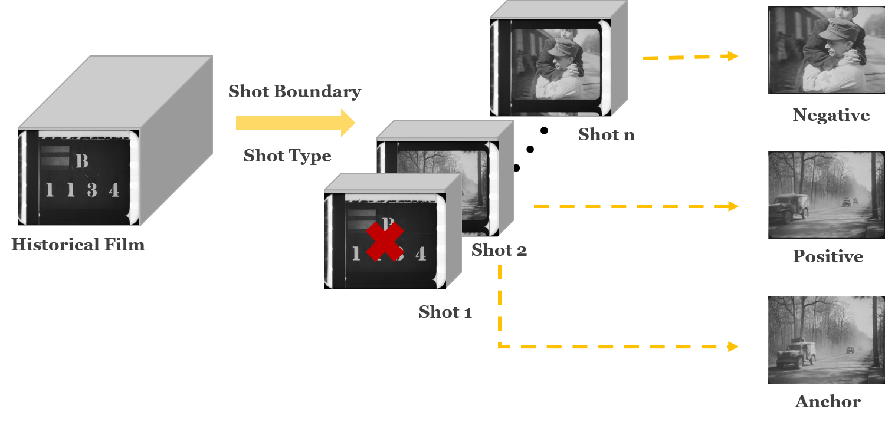
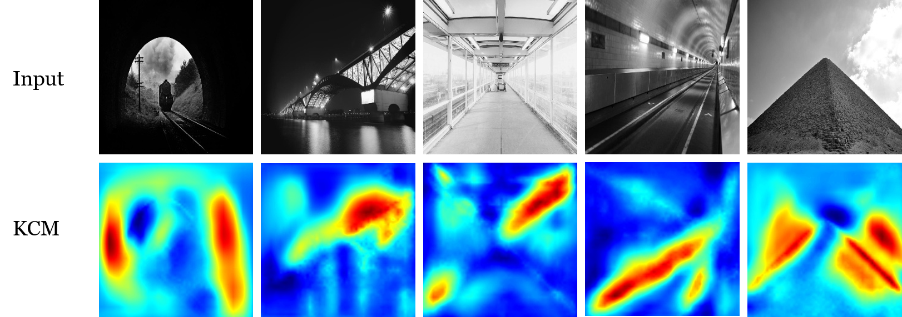
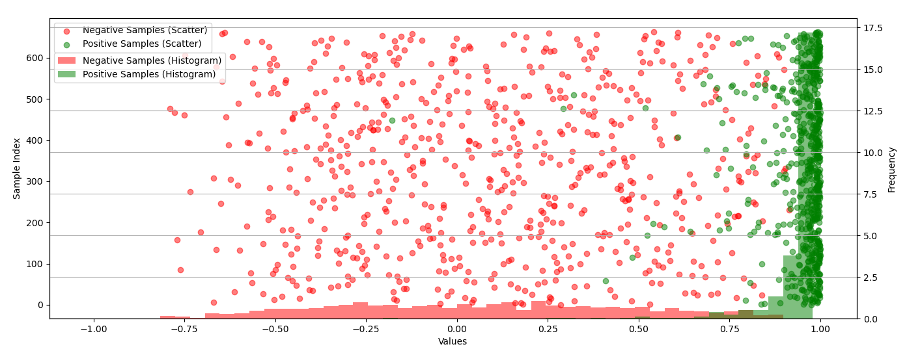
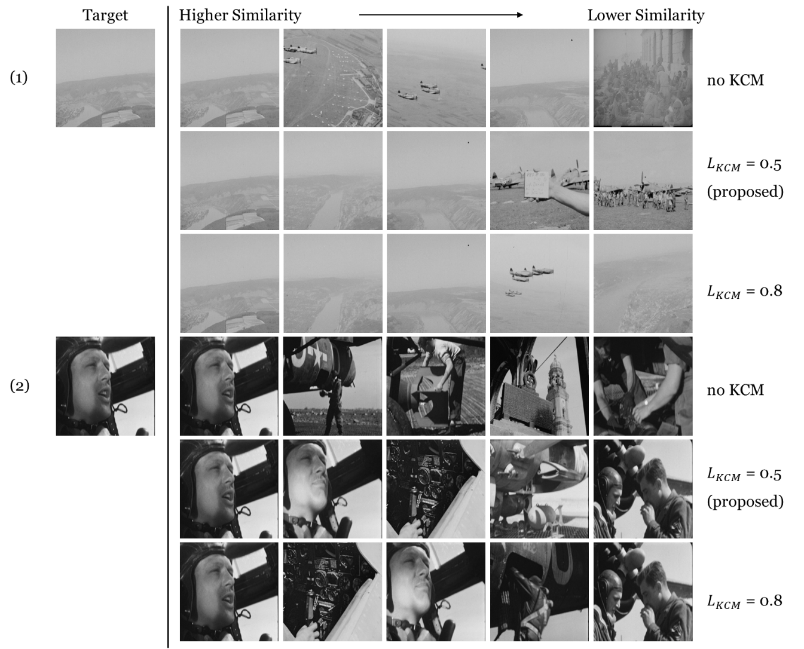

# Composition and Content-Based Image Retrieval(CCBIR)

This is the official webpage of the paper "Enhancing Historical Image Retrieval with Compositional Cues", accepted to AIRoV – The First Austrian Symposium on AI, Robotics, and Vision

Arxiv: https://arxiv.org/abs/2403.14287

**News**:

- **Mar. 27, 2024**: We delivered an oral presentation of this paper at [AIROV](https://airov.at/).
- **Mar. 20, 2024**: We release the code for CCBIR.


## 1 Network Architectures



## 2 Datasets

Our work is divided into two main segments: the task of image composition classification and the task of image retrieval. 

The dataset employed for the image composition classification task is the [KU-PCP dataset](http://mcl.korea.ac.kr/research/Submitted/jtlee_JVCIR2018/), introduced by J.-T. Lee et al.

For the image retrieval task, we extract data from the [HISTORIAN dataset](https://zenodo.org/records/6644516), which is richly annotated. The extraction process is shown as follows, and for more details, please refer to our paper:




## 3 Results

Visualisation of KCM effect. The top row features the original grayscale images, and the bottom row highlights the KCM, pinpointing key compositional areas as detected by our model:



Scatter plot and histogram of positive and negative samples when $L_{KCM}$ is 0.5:



Comparison of retrieval results with different $L_{KCM}$. We selected only the central frame image from each shot in the test set as the target database for retrieval, returning the five highest similarity-scored images for a single image query:




## 4 Implementation

The implementation of the CAM and KCM mechanisms within CCNet draws significantly from [CACNet-Pytorch](https://github.com/bo-zhang-cs/CACNet-Pytorch).

### 4.1 File Structure

```
CCBIR:.
|   
+---CBIRNet
|       dataset.py
|       network.py
|       network_cc.py
|       network_module.py
|       select_frames.py
|       test.py
|       test_one.py
|       test_vis.py
|       train.py
|       trainer.py
|       transform.py
|       utils.py
|       validation.py
|       __init__.py
|       
+---CCNet
|       dataset.py
|       network.py
|       network_module.py
|       train.py
|       trainer.py
|       transform.py
|       utils.py
|       validation.py
|       __init__.py
```

### 4.2 Required Libraries

Please refer to environment.yml. Create a new conda environment using the following command:
```bash
conda env create -f environment.yml
```

### 4.3 Training & Testing

During the training phase:

Please ensure that the required files are placed in the data folder, then run train.py to commence training.

During the testing phase:

For CCNet, please run validation.py to test your model. Download the pre-trained CCNet model from this [link](https://drive.google.com/drive/folders/1IE1QjSxgV1HmA36ItUsSVj2XCB6Q4XAe?usp=sharing).

For CBIRNet, use test.py to conduct an overall performance evaluation on a test set; employ test_vis.py for visualization of the results generated by test.py; utilize test_one.py to find the closest image in a specified image folder for a given input picture.


### 4.4 Build Your Own CBIRNet Dataset

Please use select_frames.py to build your own dataset.


## 5 Citation

If you find this work useful for your research, please cite arxiv version:

```bash
@article{lin2024enhancing,
  title={Enhancing Historical Image Retrieval with Compositional Cues},
  author={Lin, Tingyu and Sablatnig, Robert},
  journal={arXiv preprint arXiv:2403.14287},
  year={2024}
}
```

Please create an issue or contact tylin@cvl.tuwien.ac.at for further questions.
